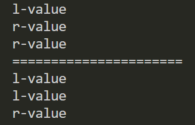

# 万能引用
1. 万能引用不能被 `const` 修饰。
2. 当函数参数是万能引用时，实参的**const属性**和**左值/右值属性**将被保持。
3. 函数形参始终保持**左值**属性。
## 万能引用的作用
如果采用右值来初始化万能引用，就会得到一个右值引用；如果采用左值来初始化，则会得到一个左值引用。

万能引用通常出现的两种场景：`函数模板的形参` 和 `auto声明`。
```C++
template<typename T> 
void f(T && param);   //param是万能引用

auto && var2 = var1; //var2是万能引用
```

即，如果遇到了**变量**或**参数类型**是 `T &&` 这样的形式，此时就有可能是万能引用（之所以是**有可能**是因为还需要满足两个条件）:

1. `T` 必须进行类型推导
2. 必须精确具有 `T &&` 形式


对于 1. ，如果类型推导并未发生，则 `T &&` 就代表右值引用，示例如下：
```C++
template <class T,class Allocator = allocator<T>>
class vector{
public:
  void push_back(T && x);
  ···
};
```
如 `vector` 中的 `push_back` 的形参 `x` ，虽然 `T` 是类型参数需要类型推导，但是推导并不是执行到 `push_back` 才进行，而是在 `vector` 实例化之初就已经确定，该 `vector` 实例就已经确定了 `push_back` 的参数类型。所以也可以说，万能引用的类型推导必须发生在当前语句之中。


对于 2. ，如果型别声明不精确地具备 `T &&` 的形式，则 `T &&` 就代表右值引用，两个示例如下：

```C++
template<typename T> 
void f(std::vector<T>&& param);   //param是右值引用
```
```C++
template<typename T> 
void f(const T&& param);          //param是右值引用
```
***


## 引用折叠——万能引用的原理
当引用的引用出现在允许的语境（即，万能引用时），该双重引用会被折叠成单个引用：我们有 `左值引用` 和 `右值引用`，所以就有四种可能的 **引用的引用组合**：左值-左值、左值-右值、右值-左值、右值-右值

但 C++ 规定了，如果任一引用为左值引用，则结果为左值引用。否则（即两个都为右值引用），结果为右值引用。

当我们对函数模板 `f` 实例化时，实际过程如下：
```C++
template<typename T>
void f(T && param);  // param是万能引用
```
```C++
MyClass a; // 自定义的MyClass类
f(a);  

// a 为左值，T 被推导为 MyClass& 
void f(MyClass& && param); // 调用f(a)时f的实例化
```


# 完美转发——std::forward()
`std::forward` 支持两个函数模板，一个接收左值，另一个接收右值。`std::forward` 被称为完美转发，它主要用来配合万能引用来使用，作用是保持原来的值属性不变。即，传入左值引用，经 `std::forward` 处理后该值还是左值属性；传入右值引用，经 `std::forward` 处理该值具有右值属性。

```C++
template <typename T>
T&& forward(typename std::remove_reference<T>::type& param)
{
    return static_cast<T&&>(param);
}

template <typename T>
T&& forward(typename std::remove_reference<T>::type&& param)
{
    return static_cast<T&&>(param);
}
```

## 形参中的typename(一个语法知识，可以略过)
`std::forward` 形参中的 `typename` 必须要加上，才能够说明这个模板形参通过作用域限定符使用类中定义的类型别名，而不是静态成员变量。这个是必须加的，否则编译不通过。而且只需要对模板形参使用 `typename`，因为一个已知的类，编译器都是可以直接知道这是类型还是静态数据成员。

如下示例展示了 何时需要使用 `typename`:
```C++
struct A { typedef int type; };
struct B { static int val; };

int B::val = 1; // B类中静态数据成员初始化

template <typename T_1, typename T_2>
class C {
  public:
  // 具体的类名前可以不加 typename
  typedef A::type type_A;
  // 类型参数前必须加上 typename，向编译器说明 T_1::type 中的 type 是一种类型
  typedef typename T_1::type type_T_1;
  

  C() { _c = T_2::val; /* 使用静态成员变量前不用加 typename */ }

  private:
    int _c;
};

int main() {
  C<A, B> c;  // 创建C类的对象
}

```

如上给出了两个版本的 `forward` 的实现，在此之前，先来看看 `std::remove_reference<T>::type` 的实现，思考为什么不直接在 `forward` 中定义左值右值版本，而要使用 `remove_reference`?
```C++
template< class T > struct remove_reference<T&>  { typedef T type; };
template< class T > struct remove_reference<T&&> { typedef T type; };
```
使用 `remove_reference` 是因为**一个函数的形参始终都具有左值属性**。如果继续用该参数调用其他函数，那么它永远不会调用接下来函数的右值版本，`remove_reference` 通过去掉引用修饰并重新添加引用修饰真正实现了 `std::forward` 的左值和右值版本。 

如下示例，展示了 `std::forward` 的实际使用： 
```C++
#include <iostream>

using namespace std;

template <typename T>
void print(T &t)
{
  cout << "l-value" << endl;
}

template <typename T>
void print(T &&t)
{
  cout << "r-value" << endl;
}

template <typename T>
void testForward(T &&v)
{
  print(v);
  print(std::forward<T>(v));
  print(std::move(v));
}

int main(int argc, char *argv[])
{
  testForward(1);

  cout << "======================" << endl;

  int x = 1;
  testForward(x);
}
```


# 参考资料
- [C++的万能引用解析](https://www.cnblogs.com/wickedpriest/p/14994899.html)
- [C++11：搞清楚万能引用和右值引用](https://zhuanlan.zhihu.com/p/510193287)