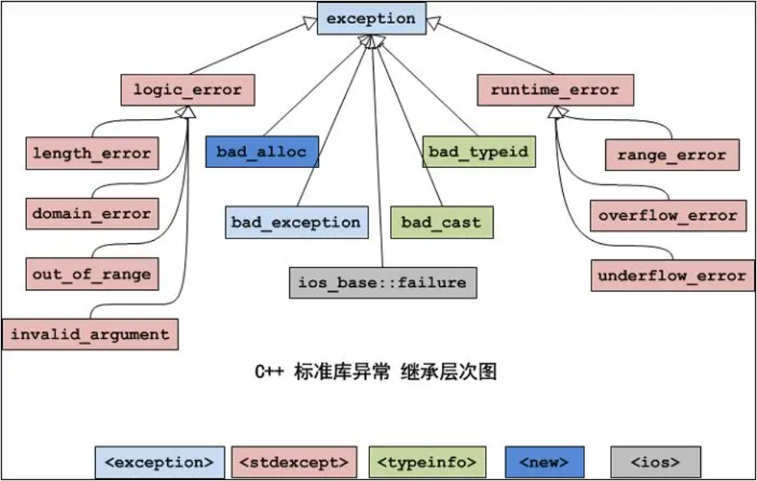

## 异常类继承层次图

[C++中的异常处理与异常安全-B站](https://www.bilibili.com/video/BV1PS4y1H73n/)

[C++ 栈展开](https://zhuanlan.zhihu.com/p/444322394)

[C++异常安全](https://zhuanlan.zhihu.com/p/318741315)

***

## 异常安全
**异常安全**：当程序发生异常的时候，程序可以回退的很干净，即满足以下两点：
1. **不会泄露资源**（已申请的资源被正确释放，包括申请的内存，拿到的互斥锁······）
2. **不会发生任何数据结构的破坏**。

## 强异常安全保证
**强异常安全保证**指的是，可能发生异常但在发生异常时代码保证函数对数据做的任何修改都可以被回退。

即，**如果调用成功，则完全成功；如果调用失败，则对象依旧是调用之前的状态**。

## 栈展开
当异常发生并被其上层调用函数中的`try-catch`语块捕获时，会发生**栈展开**。

异常从它的 `throw` 抛出点开始“向上”传递到匹配的 `catch` 子句。异常传递过程中，当退出了当前控制流的作用域时，该作用域内异常发生前创建的**局部对象会被销毁**(按照与创建时相反的顺序依次销毁，对于类对象，销毁时会调用它的析构函数)。上述过程称为**栈展开**（stack unwinding）。