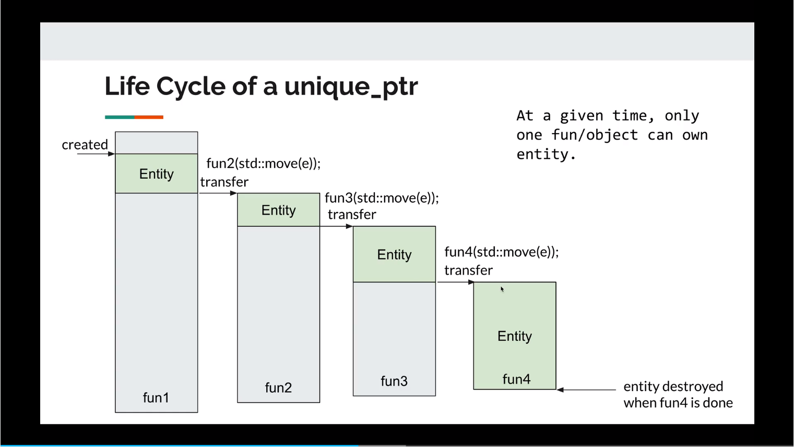
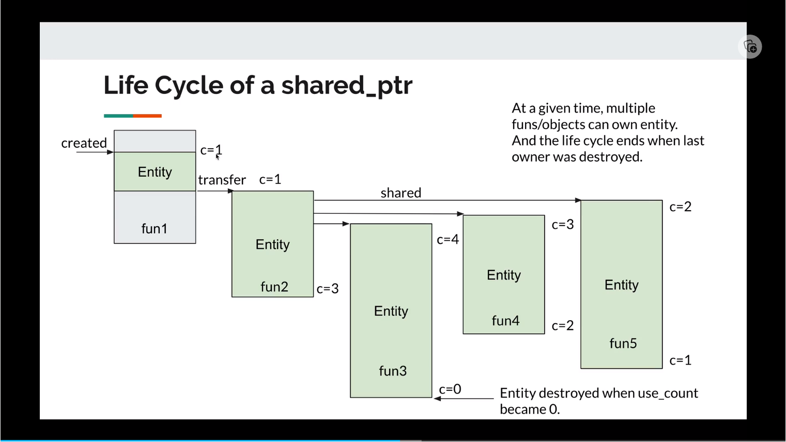
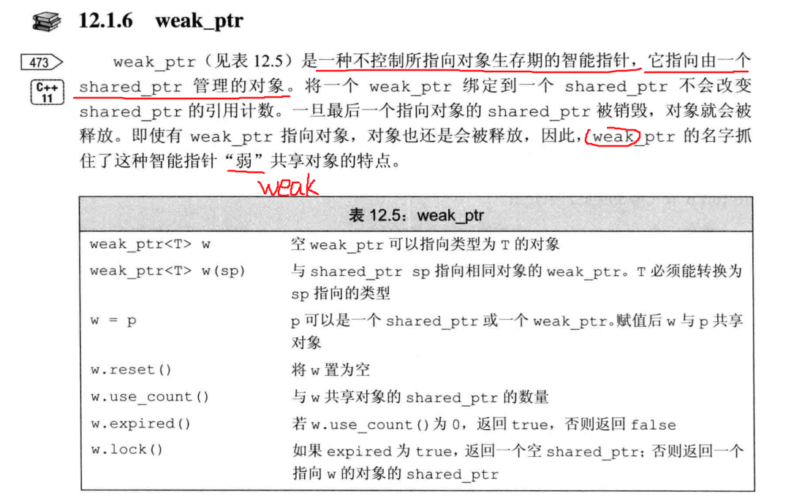
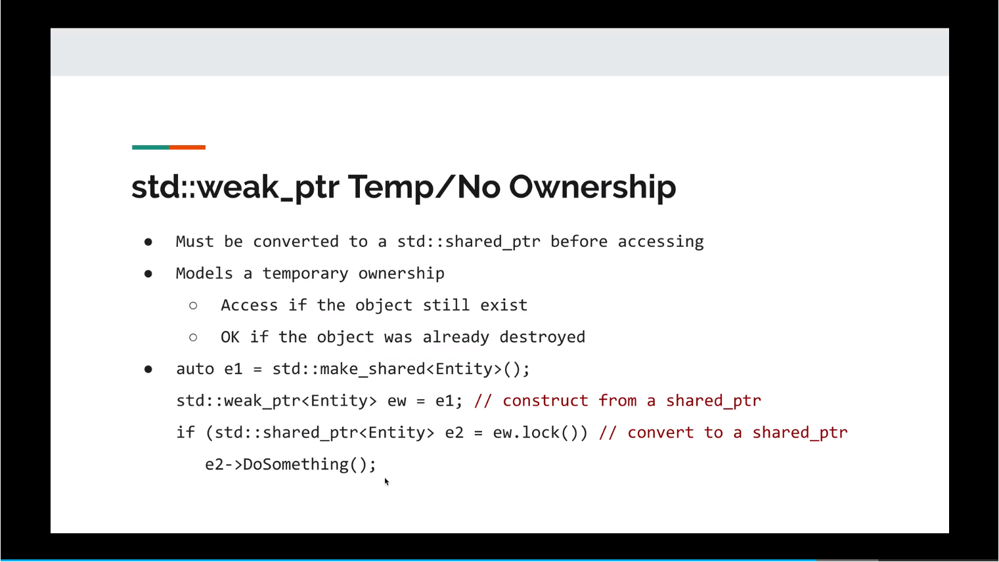

# 智能指针

## 智能指针与STL容器中的 `erase`
- 在STL容器中使用 `erase` 来删除智能指针元素，会默认调用智能指针所管理资源的**析构函数**，而如果是普通指针，则会造成内存泄漏。
```C++
struct A
{
  A(int i = 1) : i_(i) { cout << "constructor" << endl; }
  ~A() { cout << "destructor : " << this->i_ << endl; }

  int i_;
};

int main()
{
  /* vector 中调用 erase */
  vector<unique_ptr<A>> v;
  v.push_back(make_unique<A>(10));
  cout << "---" << endl;
  v.erase(v.begin());
  cout << "---\n" << endl;

  /* unordered_map 中调用 erase */
  unordered_map<char, unique_ptr<A>> m;
  m['a'] = make_unique<A>(20);
  cout << "---" << endl;
  m.erase('a');
  cout << "---\n" << endl;
  return 0;
}
```

# 智能指针的生命周期



# shared_ptr循环引用问题
```C++
using std::shared_ptr;
using std::weak_ptr;

class Person
{
public:
  Person(shared_ptr<Person> s = nullptr) : _spouse(s) { cout << "constructor" << endl; }
  ~Person() { cout << "destructor" << endl; }
  void marry(shared_ptr<Person> p) { _spouse = p; }

private:
  weak_ptr<Person> _spouse; /* 【解决办法】 */
  // shared_ptr<Person> _spouse; /* 【循环引用问题】 */
};

int main()
{
  shared_ptr<Person> wife = std::make_shared<Person>();
  shared_ptr<Person> husband = std::make_shared<Person>();
  wife->marry(husband);
  husband->marry(wife);
  return 0;
}
```

# weak_ptr

- weak_ptr的使用
