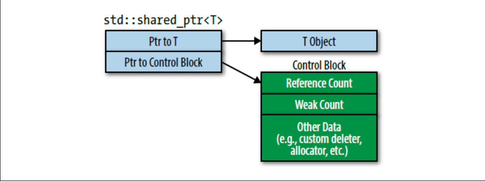
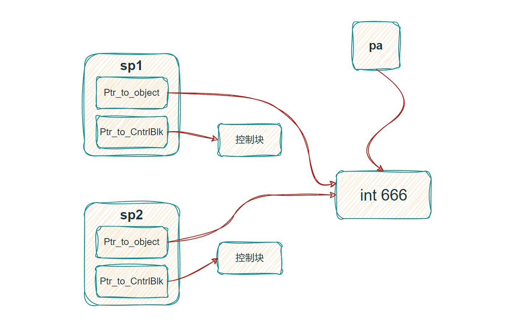
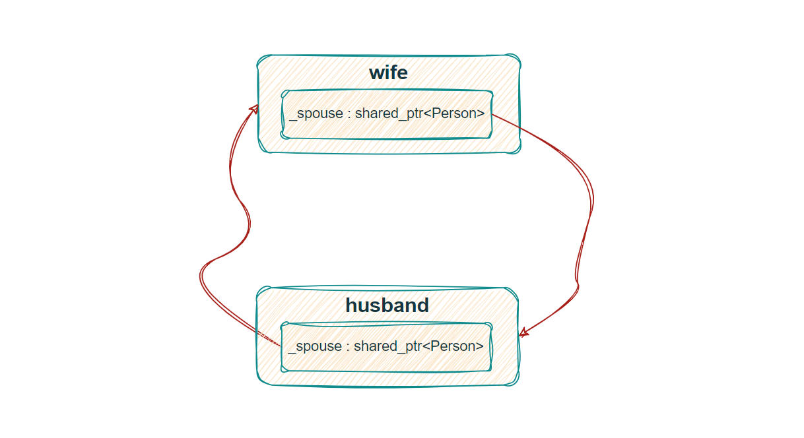

# 智能指针(Smart Pointer)

## 智能指针与STL容器中的 `erase`
- 在STL容器中使用 `erase` 来删除智能指针元素，会默认调用智能指针所管理资源的**析构函数**，而如果是普通指针，则会造成内存泄漏。
```C++ {.line-numbers}
struct A
{
  A(int i = 1) : i_(i) { cout << "constructor" << endl; }
  ~A() { cout << "destructor : " << this->i_ << endl; }

  int i_;
};

int main()
{
  /* vector 中调用 erase */
  vector<unique_ptr<A>> v;
  v.push_back(make_unique<A>(10));
  cout << "---" << endl;
  v.erase(v.begin());
  cout << "---\n" << endl;

  /* unordered_map 中调用 erase */
  unordered_map<char, unique_ptr<A>> m;
  m['a'] = make_unique<A>(20);
  cout << "---" << endl;
  m.erase('a');
  cout << "---\n" << endl;
  return 0;
}
```

## 智能指针的生命周期
- unique_ptr的生命周期


- shared_ptr的生命周期


# auto_ptr
## auto_ptr的三大弊端
1. `auto_ptr`在销毁时调用`delete`，使得它们不能用于保存数组分配的对象(`new[]`)。
2. `auto_ptr`试图利用复制语义来进行移动操作，以实现独占式拥有资源所有权。这导致了令人奇怪的代码（拷贝一个`auto_ptr`会发生资源所有权转移，并且同时会将原指针置为`NULL`）
3. 由于无法“复制”（加引号是因为不是不能复制而是复制表达的是移动语义），它们并不适配STL容器。

因此`auto_ptr`被弃用。


# unique_ptr
# unique_ptr传入自定义删除器
当使用自定义删除器时，删除器类型必须作为第二个模板实参传给`unique_ptr`。

为了将自定义删除器本身与`unique_ptr`关联，还需要把删除器本身作为`unique_ptr`构造函数的第二个实参传入。

语法格式如下：
```C++
std::unique_ptr<decltype(object), decltype(deleter)> 
                        uptr(ptr_to_object, deleter)
```


# shared_ptr

`shared_ptr`源码中大致实现如下，可以看出`shared_ptr`的大小等于**两个**原始指针的大小，在64位机器上也就是占`16`字节。一个指向资源`_Ptr`，一个指向管理资源相关信息的控制块`_Rep`。

`unique_ptr`和`shared_ptr`都支持定义删除器，但对于`unique_ptr`来说，删除器类型是智能指针类型的一部分；对于`shared_ptr`则不是。

```C++ {.line-numbers}
class _Ptr_base {
private:
  element_type *_Ptr{nullptr};
  _Ref_count_base *_Rep{nullptr};
  // ···
};

class shared_ptr : public _Ptr_base {
  // ···
};
```
## `shared_ptr`的引用计数
`shared_ptr`的引用计数不能放在`shared_ptr`对象中，这样当一个`shared_ptr`的引用计数增加或减少时，共享同一个资源的其他`shared_ptr`是不得而知的，更不能放在所管理的资源中。

因此引用计数应该放在堆空间，并将共享同一资源的`shared_ptr`都指向该引用计数，事实上引用计数被放在一个名叫控制块（control block）的数据结构中，而`shared_ptr`保存着指向该控制块的原始指针。

## `shared_ptr`在内存中的结构：
`shared_ptr`底层是两个原始指针，一个指向**资源**，一个指向**控制块**。


## 使用原始指针初始化`shared_ptr`造成未定义行为
要理解这一点，还是要从`shared_ptr`的底层实现来看，shared_ptr之所以能实现**共享**这一特性，是得益于`shared_ptr`的复制语义（拷贝构造和赋值运算符），使得 **`shared_ptr`底层的指针指向相同的资源和控制块**。

而使用一个原始指针初始化多个`shared_ptr`时，虽然创建的多个`shared_ptr`指向资源的指针是同一个，但是指向控制块的指针却是相互独立的，没有任何关系，造成了多个`shared_ptr`都以为自己才是第一个管理该资源的智能指针，从而在`shared_ptr`销毁时，对资源重复释放。

```C++ {.line-numbers}
int main()
{
  auto pa = new int(666);
  std::shared_ptr<int> sp1(pa);
  std::shared_ptr<int> sp2(pa);
}
```
以上代码执行期间报错，上面代码行`4`和行`5`的两个`shared_ptr`对象都是通过原始指针来构造的，也就是说有两个独立的控制块来管理对象的生命周期，当两个`shared_ptr`销毁的时候，这将导致这个对象会释放两次，一个对象被释放两次会导致未定义的行为（可能导致程序异常崩溃）。


以上错误代码或许还比较直观，那么请看下面这段代码，想一想哪里出错了？
```C++{.line-numbers}
class Test
{
public:
  std::shared_ptr<Test> GetPtr() {
    return std::shared_ptr<Test>(this);
  }
  static std::shared_ptr<Test> Create(const std::string& str = "null string") {
    return std::shared_ptr<Test>(new Test(str));
  }

~Test() { std::cout << "destructor" << std::endl; }

private:
  Test(const std::string& str)
    : _str(str) 
    { std::cout << "constructor" << std::endl; }

  std::string _str;
};

int main()
{
  auto sp1 = Test::Create();
  std::cout << sp1.use_count() << std::endl;
  auto sp2 = sp1->GetPtr();
  std::cout << sp1.use_count() << " " << sp2.use_count() << std::endl;
}

```
出错的位置在行`5`，出错原因和上面同理。GetPtr方法返回了一个使用原始指针`this`构建`shared_ptr`对象，虽然`sp2`管理的资源和`sp1`是一样的，但是控制块却并不是同一个。

## 使用`enable_shared_from_this`解决返回`shared_ptr`对象的控制块不一致问题
C++引入了`enable_shared_from_this`，将`enable_shared_from_this<T>`作为基类来继承（其中`T`为智能指针管理的资源类型），可以为`T`的对象提供一个成员函数`shared_from_this`，使得派生类拥有可以从`this`指针安全的构造`shared_ptr`的能力。

上述错误代码修改后，如下：
```C++{.line-numbers}
class Test : public std::enable_shared_from_this<Test> /* 修改部分 */
{
public:
  std::shared_ptr<Test> GetPtr() {
    return shared_from_this(); /* 修改部分 */
  }
  // ···
};
```

## 一个细节
这里有一个细节，就是上面的类`Test`的构造函数是私有化的，这里私有化是有意为之的，将该类的构造函数私有化之后，该类就不能通过`new`运算符来实例化该对象。这样就可以避免通过`new`方法构造原始指针变量后，利用原始指针来构造两个独立的`shared_ptr`对象的情况发生。

## `enable_shared_from_this`源码剖析
```C++ {.line-numbers}
// _Ty：派生类的类型信息通过模版参数的方式传入
template <class _Ty>
class enable_shared_from_this
{
private:
  weak_ptr<_Ty> _Wptr;

public:
  shared_ptr<_Ty> shared_from_this() { return shared_ptr<_Ty>(_Wptr); }

  shared_ptr<const _Ty> shared_from_this() const {
    return shared_ptr<const _Ty>(_Wptr);
  }

protected:
  enable_shared_from_this() : _Wptr() {}

  enable_shared_from_this(const enable_shared_from_this &) : _Wptr() {}

  enable_shared_from_this &operator=(const enable_shared_from_this &)
  { // assign (must not change _Wptr)
    return *this;
  }

/* 友元类 */
private:
  template <class _Yty>
  friend class shared_ptr;
};

/* shared_from_this的调用过程 */
enable_shared_from_this<_Ty>::shared_ptr<_Ty> shared_from_this() {
  return shared_ptr<_Ty>(_Wptr); /* _Wptr是一个weak_ptr */
}

template <class _Ty2>
shared_ptr<_Ty>::shared_ptr(const weak_ptr<_Ty2> &_Other) { 
  if (!this->_Construct_from_weak(_Other))
  {
    _Throw_bad_weak_ptr();
  }
}

template <class _Ty2>
bool _Ptr_base<_Ty>::_Construct_from_weak(const weak_ptr<_Ty2> &_Other {
  //_Other._Rep->_Incref_nz() 判断引用计数是否为0，不为零则加一并返回
  if (_Other._Rep && _Other._Rep->_Incref_nz()) {
    _Ptr = _Other._Ptr;
    _Rep = _Other._Rep;
    return true;
  }
  return false;
}

// 对enable_shared_from_this的数据成员_Wptr完成初始化
template <class _Ux, >
shared_ptr<_Ty>::shared_ptr(_Ux *_Px)
{ // construct shared_ptr object that owns _Px
  _Temporary_owner<_Ux> _Owner(_Px);
  _Set_ptr_rep_and_enable_shared(_Owner._Ptr, new _Ref_count<_Ux>(_Owner._Ptr));
  _Owner._Ptr = nullptr;
}

template <class _Ux>
void shared_ptr<_Ty>::_Set_ptr_rep_and_enable_shared(_Ux *const _Px, 
    _Ref_count_base *const _Rx)
{ // take ownership of _Px
  this->_Ptr = _Px;
  this->_Rep = _Rx;
  if constexpr (_Can_enable_shared < _Ux >>)
  {
    if (_Px && _Px->_Wptr.expired())
    {
      /* _Wptr完成初始化 */
      _Px->_Wptr = shared_ptr<remove_cv_t<_Ux>>(*this,
       const_cast<remove_cv_t<_Ux> *>(_Px));
    }
  }
}
```

## `shared_ptr`循环引用问题
```C++ {.line-numbers}
using std::shared_ptr;
using std::weak_ptr;

class Person
{
public:
  Person(shared_ptr<Person> s = nullptr) : _spouse(s) { cout << "constructor" << endl; }
  ~Person() { cout << "destructor" << endl; }
  void marry(shared_ptr<Person> p) { _spouse = p; }

private:
  shared_ptr<Person> _spouse; /* 【循环引用问题】 */
  // weak_ptr<Person> _spouse; /* 【解决办法】 */
};

int main()
{
  shared_ptr<Person> wife = std::make_shared<Person>();
  shared_ptr<Person> husband = std::make_shared<Person>();
  wife->marry(husband);
  husband->marry(wife);
  return 0;
}
```


## `shared_ptr`是最高级的管理者
`weak_ptr`并不能改变资源的生命周期，所以并不算是资源的管理者。

`shared_ptr`是最高级的管理者，因为从`unique_ptr`升级到`shared_ptr`很容易，但当资源由`shared_ptr`管理，现在又想修改资源生命周期管理方式是没有办法的，即使引用计数为一，你也不能重新修改资源所有权，改用`unique_ptr`管理它。


# weak_ptr
无论是`shared_ptr`还是`unique_ptr`都可以看作是**资源管理者**，通过管理者自身的生命周期来管理资源的生命周期，资源生命周期的结束时刻是由最终的管理者的销毁时刻来决定。而`weak_ptr`不具有被管理对象的所有权，只提供访问对象数据的功能。

`weak_ptr`原始指针功能类似，但可以通过成员函数`expire`来判断被指向对象是否已经被销毁(比原始指针更为安全)。

《C++ Primer》中对于`weak_ptr`给出的表述：


## weak_ptr的临时所有权
`weak_ptr`的临时所有权指的是,可以将`weak_ptr`升级为`share_ptr`来对对象进行访问，而当该`share_ptr`生命周期结束的时候，对应的程序流（代码）对这个对象的所有权才会进行释放，**这种随用随取，用完释放的思想对应这里的临时所有权**。

## weak_ptr的使用
 

## weak_ptr之引用计数
`weak_ptr`不影响引用计数，指的是`weak_ptr`不参与对象的**共享所有权**，因此不影响**指向对象的引用计数**。实际上在控制块中还是有第二个引用计数，weak_ptr操作的是第二个引用计数。❓


***
## 参考资料
[从源码了解Weak Point-知乎](https://zhuanlan.zhihu.com/p/617034450)
[STL enable_shared_from_this深入了解-知乎](https://zhuanlan.zhihu.com/p/638029004)
