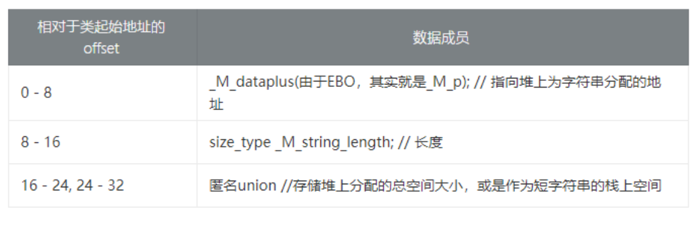

## 短字符串优化SSO
短字符串优化（**S**mall **S**tring **O**ptimization，SSO）。“短”字符串（长度小于or等于`15`个字符的）存储在了`std::string`对象的后`16`个字节中中，并没有存储在堆内存，移动这种“短字符串”和拷贝操作的开销相当。

## string类的内存占用


由图可知`string`类无论是在**栈**上分配空间还是在**堆**上分配空间都是占用`32`字节。

## 代码实例
验证**短字符串优化的内存分配**和**迭代器失效问题**
```C++ {.line-numbers}
#include <iostream>
#include <string>

int main()
{
  std::string ss1("TheLengthIs_15.");
  std::string ss2("TheLengthIs_16..");

  std::cout << &ss1 << std::endl
            << &ss2 << std::endl;
  std::cout << "===\n";

  auto ptr = ss1.begin(); // ptr是一个迭代器
  std::cout << *ptr << std::endl;

  std::cout << (void *)ss1.c_str() << std::endl
            << (void *)ss2.c_str() << std::endl;
  std::cout << "===\n";

  ss1.swap(ss2);
  std::cout << (void *)ss1.c_str() << std::endl
            << (void *)ss2.c_str() << std::endl;
  std::cout << "===\n";

  std::cout << *ptr << std::endl; // 迭代器失效
}
```

# 参考资料：
[C++ GCC STL std::string实现 （短字符串优化）](https://zhuanlan.zhihu.com/p/194395090)