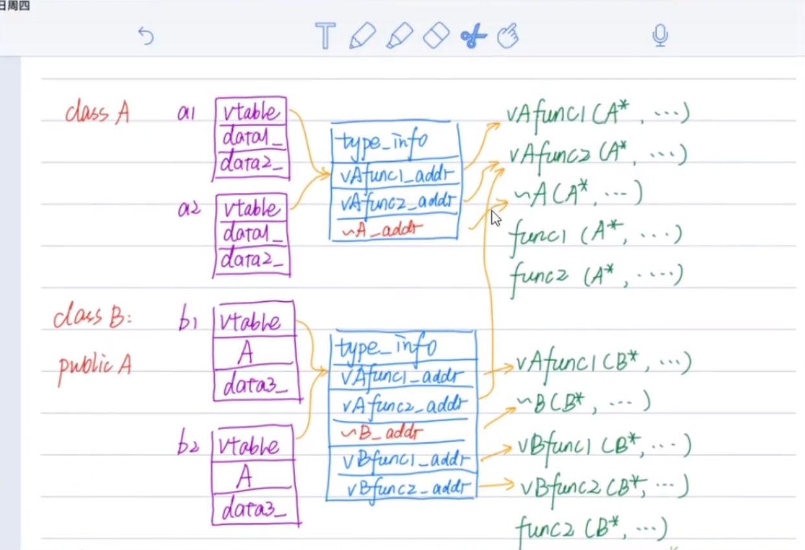

## 虚析构函数的目的
虚析构函数的作用是为了，在 `delete` 指向派生类对象的**基类指针**时，能够调用派生类对象的析构函数从而释放派生类对象申请的堆空间，防止内存泄露。

## 单继承的类对象布局
```C++ {.line-numbers}
/* 类A */
class A {
public:
  A() : data1_(new int()), data2_(new int()) {
    std::cout << "A::A()" << std::endl;
  }
  virtual void vAfunc1() { std::cout << "A::vAfunc1()" << std::endl; }
  virtual void vAfunc2() { std::cout << "A::vAfunc2()" << std::endl; }

  void func1() { std::cout << "A::func1()" << std::endl; }
  void func2() { std::cout << "A::func2()" << std::endl; }

  virtual ~A() {
    std::cout << "A::~A()" << std::endl;
    delete this->data1_;
    delete this->data2_;
  }

private:
  int *data1_;
  int *data2_;
};

/* 类B */
class B : public A {
public:
  B() : data3_(new int()) {
    std::cout << "B::B()" << std::endl;
  }
  virtual void vAfunc1() { std::cout << "B::vAfunc1()" << std::endl; }
  virtual void vBfunc1() { std::cout << "B::vBfunc1()" << std::endl; }
  virtual void vBfunc2() { std::cout << "B::vBfunc2()" << std::endl; }

  void func2() { std::cout << "B::func2()" << std::endl; }
  virtual ~B() {
    std::cout << "B::~B()" << std::endl;
    delete this->data3_;
  }

private:
  int *data3_;
};

int main()
{
  B bb;
  bb.func1();
  bb.func2();
  bb.vAfunc1();
  bb.vAfunc2();
  bb.vBfunc1();
  bb.vBfunc2();
  return 0;
}
```
