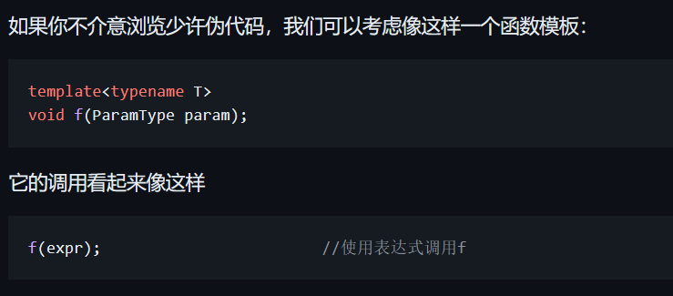

# 理解模板类型推导
> 按"某种方式"传递参数，指的是形参类型；
> "某些属性"被忽略/保留，指的是实参属性。

## 两个核心要点：
所有的参数传递可以分为两类：**引用传递**，**指针传递**。

1. 按**引用传递**时，顶层/底层 `const` 常量属性会被保持，这也正符合按引用传递时期望对象保持**不可改变性**。
    - (引用本身就具有顶层 `const` 属性，没有 `int & const a = i` )，

    
2. 按**值传递**时，顶层 `const` 常量属性和引用属性会被忽略，底层 `const` 的常量属性会被保持。
    - (按**指针传递**本质上还是按值传递)


> :star:补充:
> ————————————————————————————————————
> 1. 按引用传递，就可以**识别指针类型和数组类型**，即引用传递时数组类型被保持。在函数传参时，数组类型会退化为指针类型，但是形参声明为可以接受数组引用时，就可以区分数组类型和指针类型。
> 2. 和数组类型一样，函数类型会退化为一个**函数指针**。
>
> ————————————————————————————————————


## 举例：
类型推导都基于如下模板：


```C++
/* 值传递 */
template <typename T>
void f(T param) {}

template <typename T>
void f_p(T *param) {}

/* 引用传递 */
template <typename T>
void f_r(T &param) {}

template <typename T>
void f_u(T &&param) {}

int main()
{
  const int n = 1;
  const int *pi = &n;
  const int *const pi2 = &n;
  const int *&rpi = pi;

  f(n);   /* void f<int>(int param) */
  f(pi);  /* void f<const int *>(const int *param) */
  f(pi2); /* void f<const int *>(const int *param) */
  f(rpi); /* void f<const int *>(const int *param) */

  f_r(n);   /* void f_r<const int>(const int &param) */
  f_r(pi);  /* void f_r<const int *>(const int *&param) */
  f_r(pi2); /* void f_r<const int *const>(const int *const &param) */
  f_r(rpi); /* void f_r<const int *>(const int *&param) */

  f_p(pi);  /* void f_p<const int>(const int *param) */
  f_p(pi2); /* void f_p<const int>(const int *param) */
  f_p(rpi); /* void f_p<const int>(const int *param) */

  f_u(n);   /* void f_u<const int &>(const int &param) */
  f_u(pi);  /* void f_u<const int *&>(const int *&param) */
  f_u(pi2); /* void f_u<const int *const &>(const int *const &param) */
  f_u(rpi); /* void f_u<const int *&>(const int *&param) */

  f_u(std::move(n));   /* void f_u<const int>(const int &&param) */
  f_u(std::move(pi));  /* void f_u<const int *>(const int *&&param) */
  f_u(std::move(pi2)); /* void f_u<const int *const>(const int *const &&param) */
  f_u(std::move(rpi)); /* void f_u<const int *>(const int *&&param) */

  int a[2] = {1, 2};
  int(&ra)[2] = a;
  int(*pa)[2] = &a;
  f(a);    /* void f<int *>(int *param) */
  f(ra);   /* void f<int *>(int *param) */
  f(pa);   /* void f<int (*)[2]>(int (*param)[2]) */
  f_r(a);  /* void f_r<int [2]>(int (&param)[2]) */
  f_r(ra); /* void f_r<int [2]>(int (&param)[2]) */
  f_r(pa); /* void f_r<int (*)[2]>(int (*&param)[2]) */
  f_p(pa); /* void f_p<int [2]>(int (*param)[2]) */
}
```


## 数组类型与指针类型
- 以下代码用于验证**数组类型**和**指针类型**的区别：
```C++
  const char ss[11] = "helloworld";
  const char *sss = "helloworld";

  // 字符串字面值属于左值，左值推导为左值引用。
  cout << std::is_same<const char(&)[11], decltype("helloworld")>() << endl;
  cout << "---" << endl;

  cout << std::is_same<const char(*)[11], decltype(&ss)>() << endl;
  cout << std::is_same<const char[11], decltype(ss)>() << endl;
  cout << std::is_same<const char *, decltype(&ss[0])>() << endl;

  // 将亡值推导为右值引用
  cout << std::is_same<const char(&&)[11], decltype(std::move(ss))>() << endl;
  cout << "---" << endl;

  cout << std::is_same<const char **, decltype(&sss)>() << endl;
  cout << std::is_same<const char *, decltype(sss)>() << endl;
  cout << std::is_same<const char *, decltype(&sss[0])>() << endl;
```


## 参考资料
[C++类型推导的“坑”——忽略引用](https://www.cnblogs.com/saltedreed/p/12022576.html)