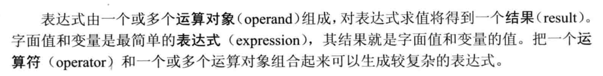

# 什么是表达式？
《C++ Primer》中对**表达式**的定义：


表达式求值会得到一个结果，该结果可能是一个左值，也可能是一个右值。

***

# 尾置返回类型
## 尾置返回类型语法
在原本函数返回类型的位置用 `auto` 代替，并在函数形参列表后使用一个 `->` 符号指出函数的返回类型。

## 尾置返回类型作用
尾置返回类型的好处是我们可以在函数返回类型中使用函数形参相关的信息。

```C++
template<typename Container, typename Index>    
auto func(Container& c, Index i) /* func 接受一个序列容器和索引 */
    ->decltype(c[i])
{
    authenticateUser();
    return c[i];
}
```
***

# 理解 `decltype` 
## `decltype` 的主要用途
在C++11中，decltype最主要的用途就是用于声明函数模板，而这个函数返回类型依赖于形参类型。

## `decltype` 的返回类型
`decltype` 可以作用于**单纯的变量名**与**复杂的表达式**。
> 单纯的变量名：decltype 作用的对象没有包含运算符
> 复杂的表达式：decltype 作用的对象包含运算符
1. 作用于**单纯的变量名**时，`decltype` 返回变量的声明类型（保留变量所有的修饰属性： 顶层/底层 `const` 和引用）。
2. 作用于**复杂的表达式**时，表达式结果是左值，则返回类型的引用；表达式结果是右值，则返回类型不包含引用。
```C++
int a = 10, *pa = &a;

decltype(pa) b;     /* int *b */
decltype(*pa) b;    /* int &b */
decltype(pa + 0) b; /* int *b */
```

除此之外，当 `decltype` 作用于圆括号修饰的**单纯的变量名**时，返回变量的引用类型。
```C++
int a = 10;

decltype(a) b;   /* int b */
decltype((a)) b; /* int &b */
```

## `decltype(auto)` 用作返回值类型

### 为什么有这种语法？
一方面，当 `auto` 用作函数返回值类型推导时，会使用**模板类型推导**的那套规则，也就是说表达式的**引用属性**会被忽略，有时希望引用属性被保留，所以需要 `decltype`。

另一方面，`decltype(auto)` 简化了尾置返回类型的写法。

### 理解 `decltype(auto)`
如何理解 `decltype(auto)`？，到底是 `decltype` 还是 `auto` ？

实际上我们可以这样解释它的意义： `auto` 说明符表示此处类型将会被推导， `decltype` 说明 `decltype` 的规则将会被用到这个推导过程中。

总结就是：**利用 `decltype` 的推导规则进行类型推导**。

### 使用 `decltype(auto)`
使用 `decltype(auto)`，就可以将版本二的func，写成版本一的func
```C++
template <typename T>
T &&myforward(std::remove_reference_t<T> &param) {
  return static_cast<T &&>(param);
}

template <class T>
decltype(auto)
mymove(T &&param) {
  return static_cast<std::remove_reference_t<T> &&>(param);
}

/* 版本一func */
template <class T>
decltype(auto)
func(T &&param) { 
  return param; 
}

/* 版本二func */
template <class T>
T &&func(T &&param) { 
  return myforward<T>(param); 
}

int main()
{
  int a = 10;
  func(a);
  func(mymove(a));
}
```

***

