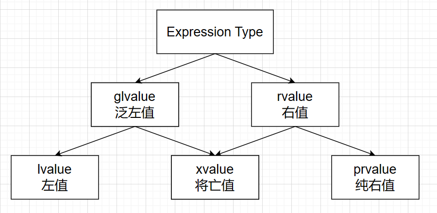

#  顶层const和底层const
- **《C++Primer》** 2.4.3节中讲述了顶层const和底层const。
> 在对象拷贝时，顶层const可以忽略，而底层const在**拷贝**和**被拷贝**的对象之间必须保持一致。
  
下面列举了一些顶层const和底层const：
  
``` C++
const int *p = new int(10);     // 底层const
int *const pp = new int(20);   // 顶层const
const int a = 10;               // 顶层const
const int & ra = a;             // 底层const（引用本身具有顶层const属性）
```
  
再考虑如下代码:
  
```C++
const int a = 10;   // 顶层const
int *p = &a;        // ❌报错
```
  
虽然 `a` 此时是顶层const，但是对 `a` 取地址后，对于地址而言，修饰 `a` 的const就变为了底层const。
  
***
  
#  表达式类型 & 右值引用
- **《C++Primer》** 4.1.1节中讲述了**左值**与**右值**。
> 使用右值时，使用的是对象的值本身(它的内容)。
> 使用左值时，使用的是对象的身份(它在内存中的位置)。
  
##  操作符的返回值
不同操作符返回是右值还是左值是有区别的，现在考虑自增运算符（自减运算符同理），思考为什么会报错：
  
```c++
    int a = 10;
    int *p1 = &(a++);   // ❌报错
    int *p2 = &(++a);   // ✔
```
  
原因在于，前置++和后置++返回值的左值右值属性不同，**前置++返回自身引用（属于左值），后置++返回临时对象（属于右值）**：
  
```c++
struct T
{
    int i;
  
    // 前置++
    T & operator++()
    {
        ++(this->i);
        return *this;
    }
  
    // 后置++
    T operator++(int)
    {
        T temp = *this;     // 拷贝一个副本
        ++(*this);          // 调用前置++
        return temp;        // 返回副本
    }
};
```
##  左值引用与右值引用
1. 顾名思义，左值引用是对左值变量的引用，右值引用是对右值的引用。
2. 右值引用必须绑定到右值上。
3. 非`const`左值引用只能绑定到左值上，`const`左值引用既可以绑定左值也可以绑定右值。 
  
**注：`字符串字面值` 是左值(如下代码所示，可以取地址)，除此之外其他字面值均是右值。**
  
```C++
std::cout << &("Helloworld") << std::endl;  // 打印结果：0x404001
```
  
###  const左值引用 
```c++
const int &a = 10; //✔正确
```
  
`const`左值引用既能绑定左值也能绑定右值，实际是通过如下方式实现：
  
```C++
int temp = 10;          // 编译器创建临时对象
const int &a = temp;    // cosnt左值引用实际绑定到临时对象上
```
###  右值引用
- **《C++Primer》** 13.6.1节中讲述了**右值引用**。
  
在只有复制语义时，拷贝构造函数和拷贝运算符函数的形参类型为**const左值引用**，而const左值引用根本不能区分出左值和右值。为了解决这个问题c++11引入了新的引用类型，称为 “右值引用”，用于识别右值。
  
> c++11中提出了 `右值引用`，是为了和 `左值引用` 区分开来，`右值引用` 限制了其只能接受右值（**能够接受①没有名称的临时对象以及②使用了std::move的对象**），可以识别出右值，因而利用这个特性从而实现**移动语义**。
  
  
  
:exclamation:右值引用有一个重要的属性，即它们只能绑定到即将被销毁的对象。

右值引用本身是**左值**，不能把一个右值引用类型的变量绑定到右值引用上。
  
##  C++11的表达式类型（value category） 
在 C++11 中，一共有 5 种 value：
- lvalue (Left-hand-side value)
- rvalue (Right-hand-side value)
- xvalue (eXpiring value)
- prvalue (Pure rvalue)
- glvalue (Generalized lvalue)
  
它们之间的关系如下图：

  
> 为什么有这些表达式类型的产生？
  
答：在提出了右值引用后，表达式类型的划分由两个条件决定：
1. 是否有身份（地址）
2. 能否移动
  
每个C++表达式只属于三种基本值类别中的一种：**左值 (lvalue)、纯右值 (prvalue)、将亡值 (xvalue)。**
**C++没有既无“身份”也不能“被移动”的表达式**，两个条件排列组合后有三种结果，其中 **将亡值（xvalue）对应有“身份”且能“被移动”的表达式。**
  
C++11后，严格定义的左值和右值是由上述两个条件所决定的，在不考虑**移动**的情况下，可以简单依靠能否取地址区分左值右值，但是在移动语义情况下，能否取地址只能说明表达式当前是否有身份，表达式具体类型还需要考虑其是否可移动。
  

  