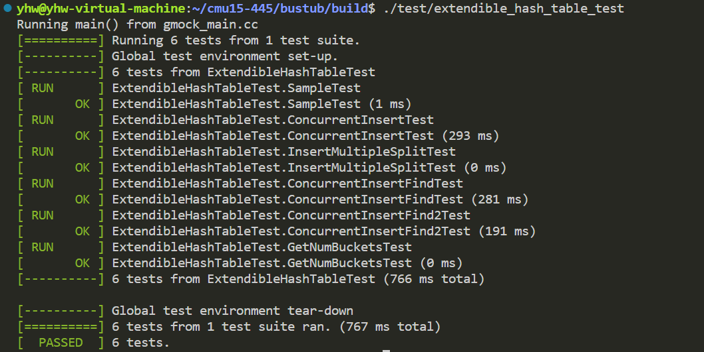
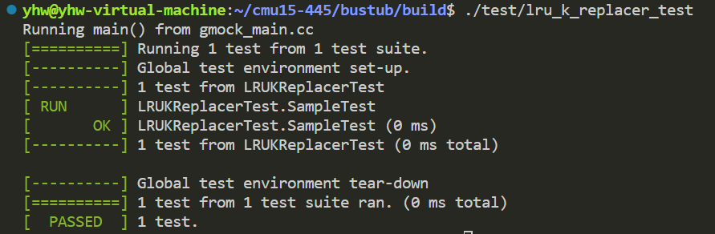
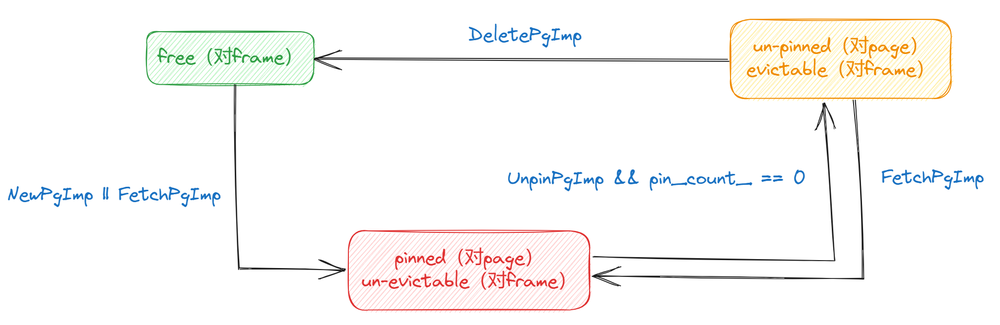
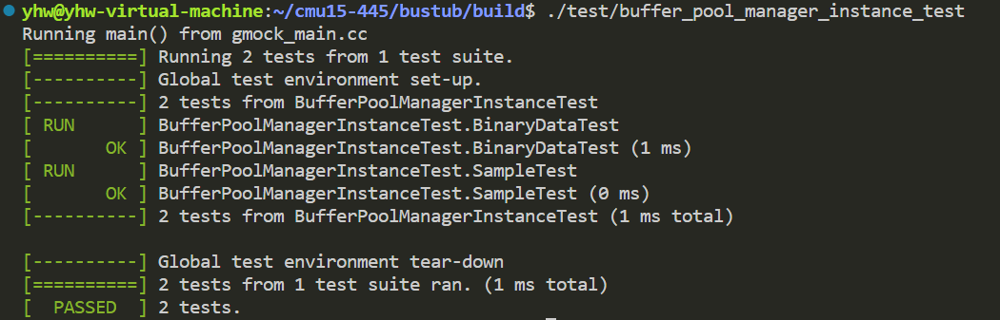

# Task #1 - 可扩展哈希表

## 参考资料：
[Extendible Hash Table 可扩展哈希详细理解](https://blog.csdn.net/MelroseLbt/article/details/129329316)
[Extendible Hashing (Dynamic approach to DBMS)](https://www.geeksforgeeks.org/extendible-hashing-dynamic-approach-to-dbms/)

#### 本地测试通过

***
# Task #2 - LRU-K替换策略

## 参考资料：
[LRU-K Replacement Policy详细理解](https://blog.csdn.net/MelroseLbt/article/details/130175678) 
[LRU-K算法详解及其C++实现 CMU15-445 Project#1](https://blog.csdn.net/AntiO2/article/details/128439155)

## 1. LRU
LRU —— 最近最久未使用
LFU —— 最近最少使用

| 题目 | 答案 |
| --- | --- |
| [leetcode-146. LRU 缓存](https://leetcode.cn/problems/lru-cache/) | [leetcode-146代码实现](.\leetcode-146_LRU_Cache.cpp) |
| [leetcode-460. LFU 缓存](https://leetcode.cn/problems/lfu-cache/) | [leetcode-460代码实现](.\leetcode-460_LFU_Cache.cpp) |

`LRU`用语言表述一句话就是：选择出最长时间不访问的页。

## 2. LRU-K

无论是`LRU`还是`LRU-K`，亦或是`Clock`替换策略，它们都不做任何实际的底层内存上的操作（应该由操作系统完成），这些替换策略仅仅是记录`frame`的某些状态，并根据一定的策略将可以驱逐的`frame id`号提供给系统。

### 重点在于数据结构的设计：
类似于LRU，LFU缓存的设计，需要定义特殊的`LRUKNode`节点数据结构。
对整个替换类分析之后，LRU-K的采用**双向链表+哈希**的策略，两个std::list双向链表`temp_list_`和`cache_list_`分别存访问次数`小于k次`和`大于等于k次`的LRUNode（每个frame都有一个LRUNode），一个std::unordered_map哈希表存frame id到LRUNode的映射，以便于在O(1)时间复杂度内找到节点。其余一些数据成员的定义见 [lru_k_replacer.h](.\lru_k_replacer.h) 文件。

1. 先使用C++标准库中的`std::list` + `std::unordered_map` 来实现 ... 
2. ... 再考虑手动造一个双向链表，以此来替代`std::list`（暂时未完成）。

### LRU-K替换策略——相关关键词的定义：
**时间戳**：时间戳的标准定义是这样的：时间戳就是Unix时间戳(Unix timestamp)，定义为从格林威治时间**1970年01月01日00时00分00秒**起至现在的总秒数。然后时间戳是不会跟着时区的改变而改变，所以不管你在哪个时区，时间戳都是一致的。这样我们就避免了重复修改数据所带来的错误。**但是**，在本项目中并没有使用真正的时间戳定义，而是类似于计数器，没访问一个页面就将该“时间戳”自增一。

**k-距离(k-distence)**：**当前时间戳**和**倒数第k次访问该页的时间戳**之差。

### 本地测试通过

## 3. 参考资料：
[LRU、LFU和FIFO辨析](https://www.jianshu.com/p/b0ecc4fdb747)

***
# Task #3 - 缓冲池管理器
## 参考资料：
[CMU 15-445 (FALL 2022) Project #1 Buffer Pool题解](https://blog.csdn.net/AntiO2/article/details/128554356)

## 数据成员
| 主要数据成员 | 作用 |
| --- | --- |
| size_t `pool_size_` | 缓冲区是以frame为单位的，pool_size_指的是frame的数量 |
| std::atomic<page_id_t> `next_page_id_` = 0; | // ❓暂时没有明白next_page_id_的意义 |
| const size_t `bucket_size_` = 4 | 可扩展哈希表中桶的大小为4 |
| Page *`pages_` | 缓冲池是一个连续分配的数组 | 
| ExtendibleHashTable<page_id_t, frame_id_t> *`page_table_` | 页表，用于页号到页帧号的映射 |
| LRUKReplacer *`replacer_` | LRU-K替换器 |
| std::list<frame_id_t> `free_list_` | 保存空闲的frame号的链表 |

## 踩过的坑：
1.可扩展哈希表记录(`page_id` - `frame_id`)的映射，**Insert**函数保证了key(`page_id`)不能重复，而不保证value(`frame_id`)不重复。也就是说每次从缓冲区驱逐一个frame后，要调用**Remove**函数，将frame之前存的page的`page_id`映射从`page_table_`中删除掉，否则就会出现**不同的page_id映射到同一个frame_id**的键值对的情况。

2.之前考虑过一个问题，一个page里只有`pin_count_` == 0时，才可以将page替换，一个frame里只有`is_evictable` == true时，才可以将frame替换。那有没有可能出现这种情况：即，一个存储在frame上的page，它的frame标记为可驱逐，但是page的`pin_count_`不为0，那么存储在改frame上的的page到底是可以被替换还是不可以被替换？ 

实际上这也正是 Buffer Pool Manager Instance 应该处理的问题，也就是**UnpinPgImp**函数应该考虑的问题，在这个函数里面，我们通过一把大锁std::scoped_lock在函数执行一开始上锁，保证了一个page的`--pin_count_ == 0`操作和一个frame的`is_evictable == true`操作的原子性，即，只有通过**UnpinPgImp**函数才可以将缓冲区中一个page解开，在解开的同时如果该page的`pin_count_`自减为0，就同时设置将frame的可驱逐标志位为**true**。

3.在Task 3的实现中需要用到**DiskManager**类，主要是用到了**DiskManager**中的了两个成员函数，**ReadPage**和**WritePage**用于从磁盘和缓冲区之间的page的读写。

## 相关概念解释：
### page和frame
**Page**：`Page`并非`page`。这句话的意思是，`Page`只是我们定义的一个类类型，而`page`在操作系统层面是分页内存管理中存放在内存中的一个页面。`Page`对象是缓冲池中内存的容器，用于存放从磁盘中读取的`page`，所以说`Page`对象实际上相当于是`frame`，在系统的整个生命周期中，一个`frame`在不同时刻可能会包含不同的`page`，即，一个`Page`对象在不同时刻可能包含不同的页面。

**弄懂了Page的概念后，才突然意识到。。。数据库管理系统(DBMS)是处于软件层面的，所以一个使用高级编程语言开发DBMS过程中的各种定义，如page，frame都只是软件层面上的，和底层操作系统(OS)中的page和frame是没有任何关联的。所以切记不要和OS中内存管理相关概念混淆。**

## page/frame的状态机
`frame`和`page`在实际使用过程中是会混淆使用的，一个`frame`没有存放任何`page`时，那就是一个`frame`，但是如果此时`frame`存放了`page`后，这块内存既可以说是`frame`也可以说是`page`。

[什么是状态机？](../../文章集合/状态机.md)
> **状态机**是 有限状态自动机 的简称，是现实事物运行规则抽象而成的一个数学模型。
> 状态机有四个概念（SEAT）：
> 1. 状态(**S**tate)。一个状态机至少要包含两个状态。
> 2. 事件(**E**vent)。事件就是执行某个操作的触发条件或者口令。
> 3. 动作(**A**ction)。事件发生以后要执行动作。编程的时候，一个 Action 一般就对应一个函数。
> 4. 变换(**T**ransition)。也就是从一个状态变化为另一个状态。

我们利用状态机的概念来分析page/frame的运行机制，来更好的理解 buffer pool manager 的实现过程：

- 红黄绿三个方框对应**状态**
- 蓝色字体对应**事件**或**动作**
- 黑色箭头对应**变换**

## 相关函数分析：
### BufferPoolManagerInstance::NewPgImp
在一些内存已经被分配但是尚未初始化，你需要在这些内存中构造一个对象。你可以使用 placement new （定位new）来做这件事情。

### NewPgImp和FetchPgImp有什么不同？
从磁盘访问的角度来看，NewPgImp对应的页面写回到磁盘时，是第一次落到磁盘上，而FetchPgImp是将DBMS存在磁盘上的页面读到内存中来。

### 本地测试通过

