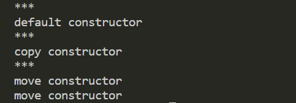

# 移动语义
移动语义使用的案例，考虑如下代码的执行过程：
```C++
class MyClass 
{
public:
    // 默认构造
    MyClass(const char* str = "chouchou") : _str(str) { cout << "default constructor" << endl; }

    // 拷贝构造
    MyClass(const MyClass & rhs) : _str(rhs._str) { cout << "copy constructor" << endl; }

    // 移动构造
    MyClass(MyClass && rhs) noexcept : _str(move(rhs._str)) { cout << "move constructor" << endl; }
private:
    string _str;
};

int main()
{
    vector<MyClass> classes;
    cout << "***" << endl;
    MyClass temp;
    cout << "***" << endl;
    classes.push_back(temp);
    cout << "***" << endl;
    classes.push_back(move(temp));
}  
```
运行结果：

> :exclamation: 最后执行两次move是由于vector的动态扩容机制

容器vector支持动态扩容，在扩容后不仅要将新元素添加进来，还需要将老元素挪到新的内存空间中。但是如果老元素的挪动采用拷贝的话效率太低，为了在老元素的挪动过程使用移动语义提高效率，就需要在移动构造函数添加上noexcept说明符，noexcept说明符作用是告诉编译器此操作**不会产生异常**（即“被拷贝对象的原始数据是不会丢失的”），即人为实现了“强异常保证（strong exception guarantee）”。编译器只有确保强异常保证，才会使用移动来挪动老元素。
  
**"强异常保证（strong exception guarantee）"**：所谓强异常保证，即当我们调用一个函数时，如果发生了异常，那么应用程序的状态能够回滚到函数调用之前
  
##  std::move
> 被移动对象的状态是什么？

当一个对象被移动之后，该对象仍然是有效的，你可以继续使用它，最终它会被销毁，执行析构函数。C++明确了所有标准库中的对象，当被移动之后，会处于一个"有效但未定义的状态（valid but unspecified state）"。C++中也并没有强制的规定限制被移动对象必须处于什么状态。


## 参考资料
- [一文入魂：妈妈再也不担心我不懂C++移动语义了](https://zhuanlan.zhihu.com/p/455848360)