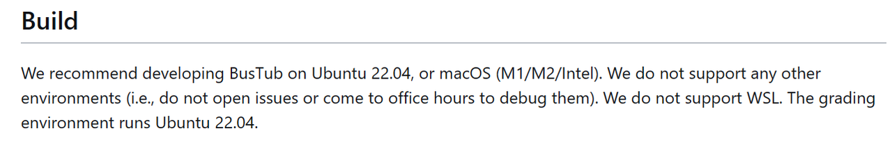

# Project的环境搭建

bustab库在 Github 的 README 中有说明（如下截取），最好在 linux 和 macOS 环境下进行开发。linux环境推荐 Ubuntu 22.04 发行版：



- [Bustub的Github链接](https://github.com/cmu-db/bustub)

## 1. 通过VSCode连接远程服务器

远程服务器采用的是 Ubuntu 22.04，为了方便起见整个项目的实现我们都将在 windows 环境下的 VSCode 中通过远程连接来进行。
vscode连接远程服务器的详细步骤
远程连接中常见问题的解决

## 2. 注册Gradescope

通过注册 gradescope 并输入下方邀请码加入课程(选择学校时需要填写Carnegie Mellon University)可以在 gradescope 提交代码，进行在线测评代码。
- 2022年课程邀请码：PXWVR5

## 3. BusTab环境安装

（在连接到远程服务器的 vscode 终端 / 直接在Ubuntu 22.04终端）上输入如下命令来安装 bustab 开发环境。

```Bash
# 4.从github上克隆bustub
git clone https://github.com/cmu-db/bustub.git 

# 切换到bustub目录下
cd bustub

# 创建新的分支，[-b选项]切换到新分支下，并基于标签为v20221128-2022fall的版本进行开发（其中branchname是新创建的分支名称，可以自己改变）
git checkout -b v2022fall v20221128-2022fall
```
