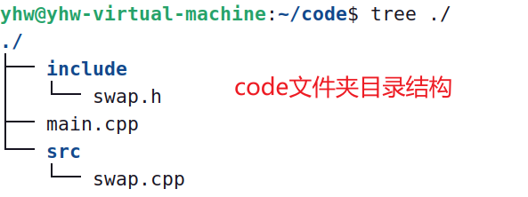
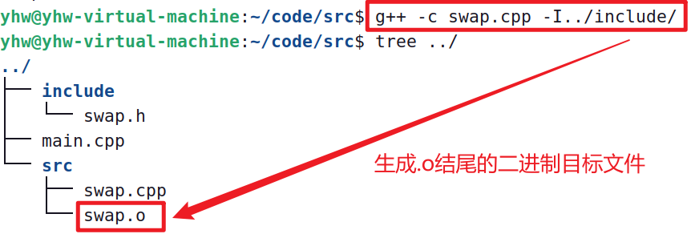
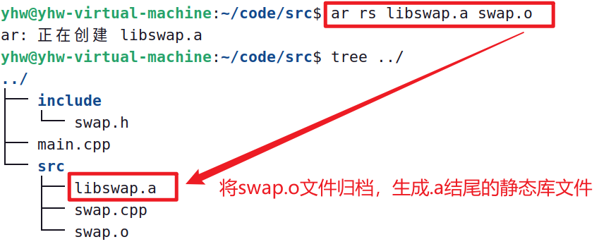
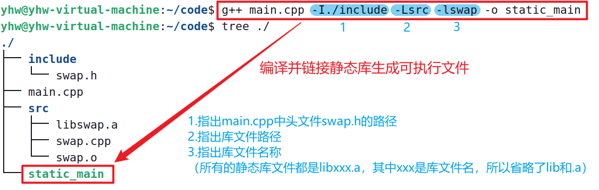
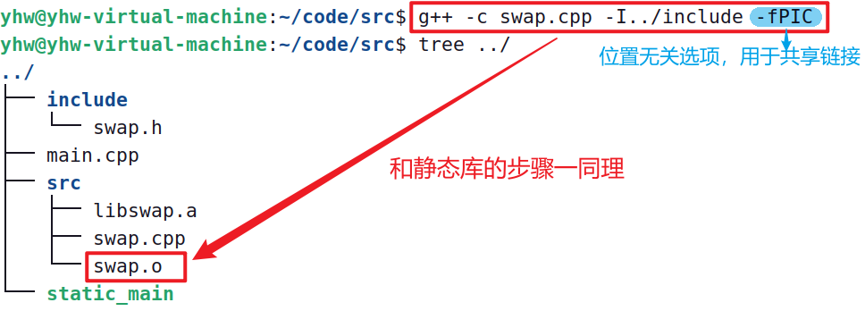
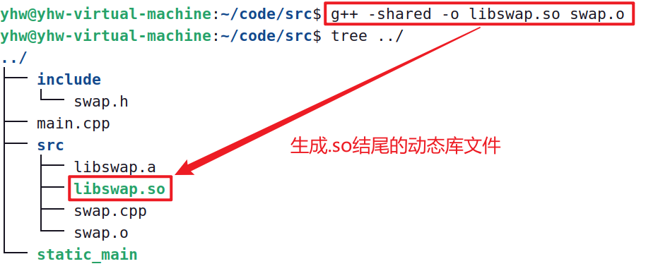
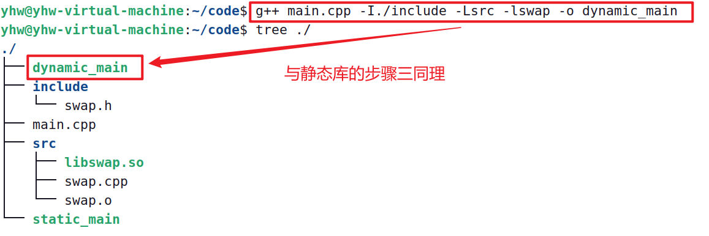
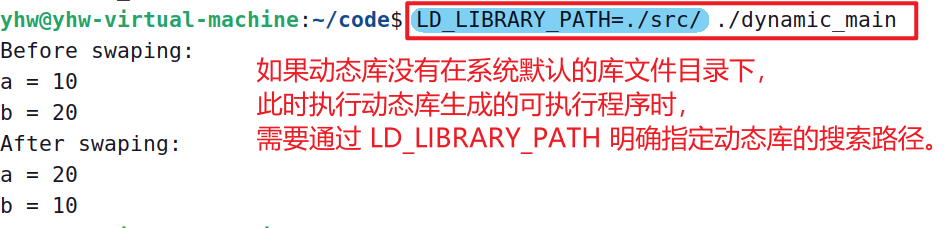

# VSCode环境配置
[VSCode配置C/C++环境_知乎](https://zhuanlan.zhihu.com/p/87864677)
[VSCode环境配置_bilibili](https://www.bilibili.com/video/BV19c411G7ey/?spm_id_from=333.337.search-card.all.click&vd_source=375df3dae169e9bfb057f61a4a79a3da)
***

# [markdown语法](https://markdown.com.cn/cheat-sheet.html#%E6%80%BB%E8%A7%88)
***

# JSON
- JSON（JavaScript Object Notation）是一种轻量级的数据交换格式。
[什么是JSON?](https://developer.mozilla.org/zh-CN/docs/Learn/JavaScript/Objects/JSON)
> tasks.json中的代码会帮我们用g++/gcc编译生成可执行文件，而launch.json中的代码是让系统来调试我们的可执行文件
***

# 在线书籍
[《Effective modern C++》](https://cntransgroup.github.io/EffectiveModernCppChinese/1.DeducingTypes/item1.html)

***
# CMake
[CMake官方学习教程](https://cmake.org/cmake/help/latest/guide/tutorial/index.html)
[CMake 良心教程，教你从入门到入魂-知乎](https://zhuanlan.zhihu.com/p/500002865)


# VScode连接远程服务器的问题解决
[VScode远程连接服务器-过程试图写入的管道不存在-could not establist connection to【已解决】](https://blog.csdn.net/a1456123a/article/details/129169897?spm=1001.2101.3001.6650.9&utm_medium=distribute.pc_relevant.none-task-blog-2%7Edefault%7EBlogCommendFromBaidu%7ERate-9-129169897-blog-105193366.235%5Ev38%5Epc_relevant_sort_base1&depth_1-utm_source=distribute.pc_relevant.none-task-blog-2%7Edefault%7EBlogCommendFromBaidu%7ERate-9-129169897-blog-105193366.235%5Ev38%5Epc_relevant_sort_base1&utm_relevant_index=15)

##  Windows下CMake的使用：
推荐使用 `外部构建` ，创建一个 build 目录存放编译产物，避免编译产物与代码文件混在一起。
```C++
mkdir build
cd build
// 生成 Makefile 文件
cmake .. // 用 .. 表示 CMakeLists.txt 在上一级目录
// 运行 Makefile 文件，将待编译链接的源码生成二进制可执行文件
cmake --build . // 用 . 表示存放到当前目录
```

```C++
// 注：带*的命令是CMakeLists.txt文件必须包含的命令

//* 指定使用 CMake 的最低版本号
cmake_minimum_required(VERSION 版本号) 

//* 指定项目名称
// 会自动创建两个变量，PROJECT_SOURCE_DIR和PROJECT_NAME
// ${PROJECT_SOURCE_DIR}  本CMakeLists.txt所在的文件夹路径
// ${PROJECT_NAME}        本CMakeLists.txt的project名称
project(项目名称) 

// 用来告诉 CMake 生成可执行文件，需要指定文件名称或源代码文件。
add_executable(项目名称 文件1 文件2 文件3 ...)

// 给文件名/路径名或其他字符串起别名，用${变量}获取变量内容
set(变量 文件名1/路径/... 文件名2 ...)

```
***

# 动态库和静态库
linux环境下，利用gcc/g++编译器生成**静态库**和**动态库**
- 生成**静态库**和**动态库**共同的操作是，都需要先利用gcc/g++将源文件生成后缀名为 `.o` 的二进制目标文件。

### 以如下code目录结构演示静态库与动态库的创建


## 静态库的创建与链接
- 步骤一

- 步骤二

- 步骤三


## 动态库的创建与链接
- 步骤一

- 步骤二

- 步骤三


### 动态库的使用


***

# GDB调试器（GNU Debugger）


***