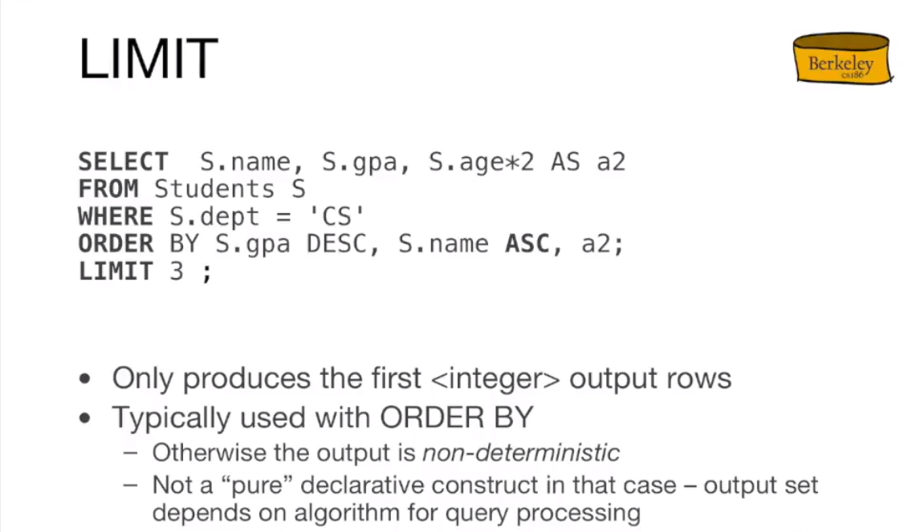

# [UCB CS186: Introduction to Database System](https://www.bilibili.com/video/BV13a411c7Qo)

***
>There are lots of synonyms here, unfortunately these terms get used interchangeably in sort of database and it's important to know all of them, please keep this slide in mind.


***


> **atomic types** means the types of the attributes(columns) shouldn't look like a tuple because you can't nest composite types like tuples inside of the tuple in SQL.
***

## - Primary/Foreign Key


***

## - SQL DML for single table query
### - 基本的单表查询


> Optionally, if you want to filter out the rows you can add the **`WHERE <predicate>`**(中括号代表是可选项)，**`predicate`** is a function that evaluates **`true`** or **`false`**. 


- By the way, note that the **`strings`** in SQL are single quotes.
> In this case, we want **`name`** and **`gpa`**, but before you send it to the output, if there are two rows in the answer that have the same **`name`** and **`gpa`**, I only want see that once.
> 
> 同时，可以为 **`FROM`** 之后的表的名称指定一个别名（alias），别名前的 **`[as]`** 可以省略。



> The argument behind the **`LIMIT`** is the number of rows you want to see.
***

### - the fllowing is an illegal query.
 
> the reason it's illegal is that you're using a column in the **`SLECT`** list that is not int the **`GROUP BY`** clause and it's also not nested inside of the **aggregate function(AGV)** that means there could be many names and we don't have any way to boil them down to one value.

>In short, it's because the `S.name` field is neither in the `GROUP BY` nor in the aggregate function.  

### - Conclusion


the basic DML(Data Manipulation Language) contains the **`SELECT`** clause with the column expression list **`FROM`** a particular table **`WHERE`** predicate is satisfied at some particular rows and optionally **`GROUP BY`** a list of columns if we group we can have a **`HAVING`** on the groups which could filter out some groups that you're not interested in and we could have **`ORDER BY`** as well as **`LIMIT`** if we want before we send output to the screen. 
***

## Defined over the single table


- the **`FROM`** clause is a good place to get started.
- the **`WHERE`** clause tell us which rows to keep (those which satisfy the predicate) and which rows to eliminate (those which don't satisfy the predicate).
- the **`SELECT`** clause tell us which columns are gonna to keep and project to screen. 
- the **`GROUP BY`** clause tell us if the tuples are going to be grouped up and formed into aggregate.
- the **`HAVING`** clause can be evaluated because it got a predicate
- the **`DISTINCT`** clause will tell us to eliminate duplicates in the output.

## Multiple table queries
> the diffience is on the upper right.


> The only difference is the **`FROM`** clause using `AS` to add aliases. 


### Find the sailor with highest rating
> this is going to give every sailor tuples whose rating is greater than or equal to all of the rating that are seen in the table.
```SQL
SELECT *
FROM Sailors AS S
WHERE S.rating >= ALL
  (SELECT S2.rating
  FROM Sailors S2)
```
> The sub-query is going to find the maximum rating in the sailors table and outer query is looking for the sailors whose rating equals to the max 
```SQL
SELECT *
FROM Sailors S
WHERE S.rating = 
  (SELECT MAX(S2.rating)
  FROM Sailors S2)
```
- The above two are just minor repharsing of the same idea.
> There is different way to express the highest rating.

> we are going to take all the sailors and columns but before we present them in the output we're going to order by rating in descending order and we're going to limit the answer to the first row.
```SQL
SELECT *
FROM Sailors S
ORDER BY S.rating DESC
LIMIT 1
```
> but this one is going to be guarenteed to return an exactly one row.


# [CMU 15-445: Database Systems](https://www.bilibili.com/video/BV1Cp4y1C7dv/?spm_id_from)
## what a DBMS should do? 
- DBMS a lot a higher level and we don't have to worry about the low level details reading the lines parsing the lines all that stuff, we just tell the database management system this is what we want and this is the answer that we want you figure out how to get it back to me.
- the body of the sql standard is like a bunch of people from various database companies and so they show up representing their database company trying to get their new features in that and to force everyone to adopt the same thing.
- **sql** is a specification that is a combination of three things.
  - Data Manipulation Language(DML)
  - Data Definition Language(DDL)
  - Data Control Language(DCL)

**SQL is based on bags(duplicates) not sets(no duplicates)**

## NESTED QUERIES


> the question is why are we going to spend much time in our database system reimplementing the wheel if potentially the Operating System can do it for us.


## Two Problems
